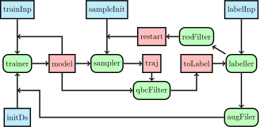

# tips/explore

The module implements the explore workflow in which a model is used to sample
the configuration space.

{: style="min-width:80%" .center}

The flowchart of the workflow is shown above, with the blue boxes being the
inputs, green boxes being the sub-workflows, and the red being intermediate
dataflow channels, the final model will be the output for each set of inputs.

## Options

| Inputs      | Default   | Description                      |
|-------------|-----------|----------------------------------|
| trainer     | `"pinn"`  | an abstract trainer              |
| sampler     | `"pinn"`  | an abstract sampler              |
| labeller    | `"lammp"` | an abstract labeller             |
| maxIter     | `0`       | max iteration                    |
| initDs      | `null`    | initial dataset                  |
| trainInit   | `null`    | initial input for trainer        |
| trainSeeds  | `2`       | number of seeds for qbc          |
| trainSteps  | `200000 ` | initial training steps           |
| retrainIter | `200000 ` | retrain steps after augmentation |
| sampleInit  | `null   ` | initial structure for sampler    |
| labelInp    | `null   ` | input for labbeller              |


## Usage

`tips/explore` assumes that we have already a minimal dataset to start with,
this might not be always the case. Below show an example of training a model
with the SPC/Fw classical force field, where an initial dataset is generated by
the same force field with a short NVT simulation (the files to reproduce this
workflow can be found
[here](https://github.com/yqshao/tips/tree/master/examples/explore-nacl))

```groovy
--8<-- "examples/explore-nacl/main.nf"
```

Here, the training and labelling configs are parsed to the explorer through
`params`.
